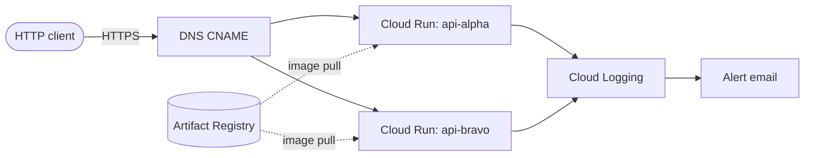

# cloud-run-handover

Terraform-managed deployment of two HTTP APIs to Google Cloud Run. Includes Artifact Registry, custom domain mapping with managed TLS, baseline observability, and optional Workload Identity Federation for CI/CD.

Ships with a placeholder container (`gcr.io/cloudrun/hello`) so the infrastructure can be deployed and verified end-to-end before introducing real application code.

## Status

Template / handover package. Not yet wired to any real application.

## Quick links

- **Deploying from scratch:** [`docs/handover.md`](docs/handover.md)
- **Operational procedures:** [`docs/runbook.md`](docs/runbook.md)
- **Manual setup commands log:** [`docs/bootstrap.md`](docs/bootstrap.md)

## Architecture at a glance



Full architecture and design rationale in [`docs/handover.md`](docs/handover.md#architecture).

## Repository layout

```
infra/
  bootstrap/        # one-time per project: APIs, state bucket, optional WIF
  modules/
    artifact-registry/
    cloud-run-service/
  envs/
    prod/
docs/
```

## Stack

- Terraform ≥ 1.6, Google provider 5.x
- Cloud Run v2, Artifact Registry, Cloud Monitoring, Cloud Logging
- GCS-backed Terraform state with versioning

## Security defaults

The `cloud-run-service` module is private and internal-only by default. Public exposure requires explicit overrides at the env layer. See [handover.md § Security defaults](docs/handover.md#security-defaults).
