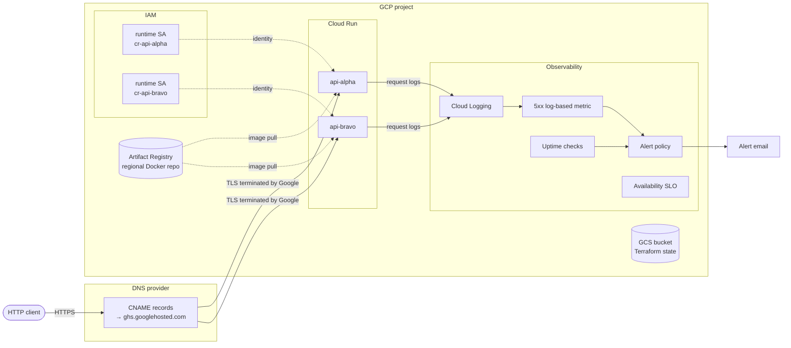

# Handover Guide

This repository deploys two HTTP APIs (`api-alpha`, `api-bravo`) to Google Cloud Run, with infrastructure managed by Terraform. It ships with a placeholder container (`gcr.io/cloudrun/hello`) so you can deploy and verify the pipeline end-to-end before introducing real application code.

## What you get

- Two Cloud Run services, each with its own dedicated runtime service account
- A regional Artifact Registry repo for container images
- Custom domain mapping with Google-managed TLS certificates
- Baseline observability: log-based 5xx alerting, uptime checks, an availability SLO
- Optional Workload Identity Federation for GitHub Actions (no service account keys)
- Terraform state stored in GCS with versioning

## What's not included (yet)

These are intentionally deferred. Each is documented under [Future work](#future-work) with the trigger that should prompt adding it.

- CI/CD pipeline (GitHub Actions workflow)
- HTTPS load balancer + Cloud Armor (WAF/DDoS)
- Multiple environments (staging, dev)
- Service-to-service authentication
- Secret Manager wiring (the module supports it; no secrets defined)
- VPC egress for private downstream resources
- Distributed tracing

## Security defaults

The `cloud-run-service` module defaults to **private and internal-only**:

- `allow_unauthenticated = false` — callers must present a valid Google ID token
- `ingress = "INGRESS_TRAFFIC_INTERNAL_ONLY"` — traffic from the public internet is rejected at the network layer

This is deliberate. The intent is that exposing a service to the internet should be an explicit decision in the env config, not something that happens by forgetting to set a variable.

This template's `prod` env overrides both defaults for `api-alpha` and `api-bravo` because the template's purpose is to demonstrate two public-facing APIs. When you adapt this for real services, leave the defaults secure and override only the services that genuinely need public access.

## Prerequisites

You need:

- **gcloud CLI** ≥ 460.0.0 — [install](https://cloud.google.com/sdk/docs/install)
- **Terraform** ≥ 1.6 — [install](https://developer.hashicorp.com/terraform/install)
- **Docker** (any recent version) for pushing images to Artifact Registry
- A **GCP organization** you can create projects in, or an existing project where you have `roles/owner`
- A **billing account** linked to that organization
- A **DNS-controlled domain** if you want custom domains (Cloud Run does not support apex domains; subdomains only)

## Architecture



### Repository layout

```
infra/
  bootstrap/        # one-time per project: APIs, state bucket, optional WIF
  modules/
    artifact-registry/
    cloud-run-service/
  envs/
    prod/           # the deployed environment
docs/
  handover.md       # this file
  runbook.md        # operational procedures
  bootstrap.md      # log of manual gcloud commands run during initial setup
```

### Why two terraform roots

- `infra/bootstrap/` enables APIs and creates the state bucket. It must run **before** anything else and uses local state on first apply, then migrates state into the bucket it just created.
- `infra/envs/prod/` consumes the modules and uses GCS-backed state from the start. This is where day-to-day changes happen.

## Initial setup

This walks you through deploying everything from scratch into a fresh GCP project. Should take 30–60 minutes including waiting for cert provisioning.

### 1. Create the GCP project (manual, ~5 min)

These five commands are the only ones run outside Terraform.

```bash
# Pick a project ID. Must be globally unique across all of GCP.
PROJECT_ID="my-cloudrun-project"
BILLING_ACCOUNT_ID="XXXXXX-XXXXXX-XXXXXX"  # from `gcloud billing accounts list`

gcloud projects create "$PROJECT_ID" --name="My Cloud Run Project"
gcloud billing projects link "$PROJECT_ID" --billing-account="$BILLING_ACCOUNT_ID"
gcloud config set project "$PROJECT_ID"
gcloud auth application-default login
gcloud auth application-default set-quota-project "$PROJECT_ID"
```

> **Why these commands and nothing else:** new GCP projects come with `serviceusage`, `cloudresourcemanager`, and `storage` already enabled. That's the minimum Terraform needs to enable everything else and create the state bucket. Anything more would be redundant.

### 2. Bootstrap (Terraform, ~3 min)

Bootstrap enables required APIs, creates the state bucket, and (optionally) sets up Workload Identity Federation for GitHub Actions.

```bash
cd infra/bootstrap

# Edit terraform.tfvars (copy from terraform.tfvars.example)
#   project_id        = "my-cloudrun-project"
#   region            = "us-central1"
#   state_bucket_name = "my-cloudrun-project-tfstate"
#   enable_wif        = false   # set true if you want GitHub Actions auth set up
#   github_repo       = "Simplifying-Cloud/<repo>"  # only used when enable_wif=true

terraform init
terraform apply

# Now migrate state into the bucket Terraform just created.
# Uncomment the backend block at the top of providers.tf, then:
terraform init -migrate-state
# Answer "yes" to copy local state into the bucket.

# Local state files are now redundant.
rm -f terraform.tfstate terraform.tfstate.backup
```

After bootstrap completes, capture the outputs — you'll need them for CI later if you enabled WIF:

```bash
terraform output
```

### 3. Deploy the prod environment (Terraform, ~3 min)

```bash
cd ../envs/prod

# Edit backend.tf — replace REPLACE_WITH_STATE_BUCKET_NAME with the bucket
# you just created in step 2.

# Edit terraform.tfvars (copy from terraform.tfvars.example)
#   project_id   = "my-cloudrun-project"
#   alert_email  = "you@yourcompany.com"
#   domain_alpha = null   # set to your subdomain when ready, see step 5
#   domain_bravo = null

terraform init
terraform apply
```

Two services are now live on `*.run.app` URLs running the placeholder container.

```bash
curl $(terraform output -raw api_alpha_url)
curl $(terraform output -raw api_bravo_url)
```

Both should return the Cloud Run hello-world page.

### 4. Verify the alert email channel (~30 sec)

Cloud Monitoring sent a verification email to the address in `alert_email`. **Click the link in that email**, otherwise alerts will never deliver.

### 5. Add custom domains (~30 min total, mostly waiting)

Skip this step if you only need `*.run.app` URLs.

a. **Update `terraform.tfvars`** with your subdomains (apex domains like `example.com` are not supported by Cloud Run):

```hcl
domain_alpha = "alpha.api.yourcompany.com"
domain_bravo = "bravo.api.yourcompany.com"
```

b. **Apply:**

```bash
terraform apply
```

c. **Read the DNS records to add:**

```bash
terraform output api_alpha_dns_records
terraform output api_bravo_dns_records
```

Each prints a CNAME record pointing at `ghs.googlehosted.com.`

d. **Add those records at your DNS provider.** Important Cloudflare-specific notes are in the [DNS notes](#dns-notes) section.

e. **Wait 15–60 min** for Google to provision TLS certs. Track status:

```bash
terraform refresh
terraform output api_alpha_domain_status
```

When both `Ready` and `CertificateProvisioned` show `status = "True"`, you're live:

```bash
curl https://alpha.api.yourcompany.com
```

## Replacing the placeholder image with real application code

The placeholder lets you verify the pipeline works before introducing application complexity. When you're ready to deploy real code, the workflow is:

### 1. Build your image

Locally or in CI, build an image targeting `linux/amd64`:

```bash
docker build --platform=linux/amd64 -t my-api:latest ./path/to/your/api
```

> **Why `--platform=linux/amd64` is mandatory:** Cloud Run runs amd64 only. If you build on Apple Silicon and skip this flag, Docker produces an arm64 image, the push succeeds, the deploy succeeds, and the container fails to start at runtime with `exec format error`. The error gives no hint about the architecture mismatch.

### 2. Tag for Artifact Registry

Get the registry URL from Terraform outputs:

```bash
cd infra/envs/prod
AR_URL=$(terraform output -raw artifact_registry_url)

docker tag my-api:latest $AR_URL/api-alpha:v1
```

> **Tag discipline:** never use `:latest`. Terraform needs an immutable reference to detect changes and produce meaningful diffs. Use `:v1`, `:v2`, … now; switch to git SHA tags when CI is added.

### 3. Authenticate Docker to Artifact Registry (one-time per machine)

```bash
gcloud auth configure-docker us-central1-docker.pkg.dev
```

This adds a credential helper to `~/.docker/config.json`. No service account key is created.

### 4. Push

```bash
docker push $AR_URL/api-alpha:v1
```

### 5. Update Terraform and apply

Edit `infra/envs/prod/terraform.tfvars`:

```hcl
image_alpha = "us-central1-docker.pkg.dev/my-cloudrun-project/services/api-alpha:v1"
```

```bash
terraform apply
```

Cloud Run creates a new revision and shifts traffic to it within ~30 seconds.

### What your container needs to do

Cloud Run has a few non-negotiable requirements:

- **Listen on the port given by `$PORT`** (defaults to 8080). Do not hardcode.
- **Bind to `0.0.0.0`**, not `localhost` or `127.0.0.1`.
- **Be stateless.** Local disk writes go to a tmpfs at `/tmp` and count against your memory limit; nothing persists across requests or revisions.
- **Handle `SIGTERM`** for graceful shutdown. Cloud Run gives 10 seconds before `SIGKILL`.
- **Start within `startup_probe.failure_threshold × period_seconds`** (default ~30 seconds with no probe). Slow-starting apps need an explicit startup probe.

The `cloud-run-service` module exposes `startup_probe` and `liveness_probe` inputs. See [Adjusting service config](#adjusting-service-config).

## Common modifications

### Adjusting service config

All Cloud Run knobs are inputs to the `cloud-run-service` module. Examples:

```hcl
module "api_alpha" {
  source = "../../modules/cloud-run-service"

  project_id = var.project_id
  region     = var.region
  name       = "api-alpha"
  image      = var.image_alpha

  cpu              = "2"
  memory           = "1Gi"
  min_instances    = 1        # warm pool — costs ~$15/mo per instance
  max_instances    = 50
  concurrency      = 40       # lower for CPU-bound workloads
  timeout_seconds  = 300

  env_vars = {
    LOG_LEVEL = "info"
  }

  startup_probe = {
    path              = "/healthz"
    period_seconds    = 5
    failure_threshold = 12   # 60s total budget
  }

  liveness_probe = {
    path = "/healthz"
  }
}
```

See `infra/modules/cloud-run-service/variables.tf` for the full input reference.

### Exposing a service publicly

Services are private by default (`allow_unauthenticated = false`, `ingress = "INGRESS_TRAFFIC_INTERNAL_ONLY"`). The two services in this template's `prod` env override both, because they are intentionally public APIs:

```hcl
module "api_alpha" {
  source = "../../modules/cloud-run-service"
  # ...
  allow_unauthenticated = true
  ingress               = "INGRESS_TRAFFIC_ALL"
}
```

For a real deployment, set both to their public values **only on services that genuinely need to be reachable from the public internet**. Internal services and backends should keep the defaults.

If a service should accept public traffic but require authentication (e.g. an API consumed by authenticated mobile clients), set `ingress = "INGRESS_TRAFFIC_ALL"` and leave `allow_unauthenticated = false`. Callers must then send a valid Google ID token.

### Adding a third service

Add another module call in `infra/envs/prod/main.tf`. Decide upfront whether the new service is public or internal:

```hcl
variable "image_charlie" {
  description = "Container image for api-charlie."
  type        = string
  default     = "gcr.io/cloudrun/hello"
}

# Internal-only service (uses module defaults — recommended for backends):
module "api_charlie" {
  source = "../../modules/cloud-run-service"

  project_id = var.project_id
  region     = var.region
  name       = "api-charlie"
  image      = var.image_charlie
}

# OR — public service (override defaults explicitly):
module "api_charlie" {
  source = "../../modules/cloud-run-service"

  project_id = var.project_id
  region     = var.region
  name       = "api-charlie"
  image      = var.image_charlie

  allow_unauthenticated = true
  ingress               = "INGRESS_TRAFFIC_ALL"
}
```

Add corresponding outputs and `terraform apply`.

If the new service is internal-only, **do not add a `domain` input** — Cloud Run domain mapping requires the service to accept external traffic.

### Adding env vars from Secret Manager

The module supports secret-backed env vars but no secrets exist yet. To add one:

1. **Create the secret** (outside this module — add to `main.tf` or a new file):

```hcl
resource "google_secret_manager_secret" "db_password" {
  project   = var.project_id
  secret_id = "db-password"

  replication {
    auto {}
  }
}

resource "google_secret_manager_secret_version" "db_password" {
  secret      = google_secret_manager_secret.db_password.id
  secret_data = "REPLACE_VIA_GCLOUD"  # don't commit real secrets
}

resource "google_secret_manager_secret_iam_member" "alpha_reader" {
  project   = var.project_id
  secret_id = google_secret_manager_secret.db_password.secret_id
  role      = "roles/secretmanager.secretAccessor"
  member    = "serviceAccount:${module.api_alpha.runtime_service_account_email}"
}
```

2. **Wire it into the module:**

```hcl
module "api_alpha" {
  # ...
  secret_env_vars = {
    DB_PASSWORD = {
      secret_id = google_secret_manager_secret.db_password.secret_id
      version   = "latest"
    }
  }
}
```

3. **Enable the API.** Add `secretmanager.googleapis.com` to the API list in `infra/bootstrap/apis.tf` and re-apply bootstrap.

4. **Set the real secret value** out-of-band (never in Terraform):

```bash
echo -n "actual-secret" | gcloud secrets versions add db-password --data-file=-
```

### Adding a new environment (e.g. staging)

```bash
cp -r infra/envs/prod infra/envs/staging
```

Then in `infra/envs/staging/`:

1. Edit `backend.tf` — change `prefix = "envs/prod"` to `prefix = "envs/staging"`. **Never share state between environments.**
2. Create a new GCP project for staging (repeat steps 1 and 2 of Initial setup against that project).
3. Update `terraform.tfvars` with the new project ID, alert email, etc.
4. `terraform init && terraform apply` from the new directory.

## DNS notes

### Cloudflare

Cloudflare is the typical test DNS provider. There are two gotchas worth knowing.

**During cert provisioning, the CNAME must be set to "DNS only" (gray cloud).** Cloud Run's managed cert uses a domain-validation challenge that requires Google to reach your hostname directly. Cloudflare's proxy intercepts these requests and the challenge fails silently — the cert stays in `CertificateProvisioning` indefinitely.

**After the cert is issued, you can switch to proxied (orange cloud) — but only with SSL mode set to Full (strict).** Other modes either skip origin cert validation (security regression) or strip TLS to the origin (causes redirect loops).

To switch to proxied:

1. Confirm `terraform output api_alpha_domain_status` shows both `Ready` and `CertificateProvisioned` as `True`
2. Cloudflare DNS → flip the CNAME to orange cloud
3. Cloudflare SSL/TLS → Overview → set mode to **Full (strict)**
4. Wait 1–2 min for edge propagation, then retest

### GoDaddy (or other registrars without proxying)

Simpler. Add a CNAME record exactly as `terraform output api_alpha_dns_records` shows it. No proxy mode to worry about.

If GoDaddy doesn't allow CNAME at the desired name (some registrars are weird about this for certain record types), use a subdomain one level deeper.

### Records change over time

Cloud Run domain mapping records are stable in practice but not contractually guaranteed. If you ever see a sudden domain mapping failure with no infra changes, re-read the records from Terraform outputs and reconcile against your DNS provider.

## Future work

Each item below is intentionally deferred. The "trigger" tells you when to add it.

### CI/CD pipeline

**Trigger:** anyone other than you needs to deploy, or you push more than once a week.

If WIF was enabled in bootstrap, the GCP side is already done. Add `.github/workflows/deploy.yaml`:

```yaml
name: Deploy

on:
  push:
    branches: [main]

permissions:
  contents: read
  id-token: write

jobs:
  deploy:
    runs-on: ubuntu-latest
    steps:
      - uses: actions/checkout@v4

      - id: auth
        uses: google-github-actions/auth@v2
        with:
          workload_identity_provider: <wif_provider_from_bootstrap_outputs>
          service_account: <gha_deployer_sa_email_from_bootstrap_outputs>

      - uses: google-github-actions/setup-gcloud@v2

      - name: Configure Docker
        run: gcloud auth configure-docker us-central1-docker.pkg.dev

      - name: Build and push
        run: |
          docker build --platform=linux/amd64 -t $IMAGE ./services/api-alpha
          docker push $IMAGE
        env:
          IMAGE: us-central1-docker.pkg.dev/${{ vars.GCP_PROJECT_ID }}/services/api-alpha:${{ github.sha }}

      - uses: hashicorp/setup-terraform@v3

      - name: Terraform apply
        working-directory: infra/envs/prod
        run: |
          terraform init
          terraform apply -auto-approve \
            -var="image_alpha=us-central1-docker.pkg.dev/${{ vars.GCP_PROJECT_ID }}/services/api-alpha:${{ github.sha }}"
```

If WIF was not enabled, re-run `infra/bootstrap` with `enable_wif = true` and `github_repo` set.

### HTTPS load balancer + Cloud Armor

**Trigger:** you need any of: a WAF, IP allowlisting, geo-blocking, a CDN, single hostname with path-based routing across services, or hiding `*.run.app` URLs.

The current setup terminates TLS at Cloud Run directly. To migrate:

1. Add `compute.googleapis.com` and `certificatemanager.googleapis.com` to `infra/bootstrap/apis.tf`, re-apply.
2. Add a `modules/load-balancer/` module:
   - Reserve a global static IP
   - Serverless NEG per Cloud Run service
   - URL map with path matchers
   - Google-managed SSL cert resource
   - Cloud Armor security policy
3. Flip each service's `ingress` input to `INGRESS_TRAFFIC_INTERNAL_LOAD_BALANCER` so the `*.run.app` URL is no longer reachable directly.
4. Remove the `domain` input from each service module call (LB-issued certs replace domain-mapping certs).
5. Repoint your DNS A records to the LB's static IP.

Costs roughly $18/mo baseline for the LB plus $5/mo per managed cert. The current domain-mapping setup costs $0 baseline.

### Service-to-service auth

**Trigger:** one of your services needs to call another. Note that with the secure defaults (`INGRESS_TRAFFIC_INTERNAL_ONLY`), services in the same project can already reach each other at the network level — this section is about the IAM authorization layer on top.

1. Set `allow_unauthenticated = false` on the callee.
2. Grant the caller's runtime SA `roles/run.invoker` on the callee:

```hcl
resource "google_cloud_run_v2_service_iam_member" "bravo_invokes_alpha" {
  project  = var.project_id
  location = var.region
  name     = module.api_alpha.service_name
  role     = "roles/run.invoker"
  member   = "serviceAccount:${module.api_bravo.runtime_service_account_email}"
}
```

3. In the caller's code, fetch a Google ID token from the metadata server with the callee's URL as the audience, then send it as `Authorization: Bearer <token>`. Most Google client libraries do this automatically.

### VPC egress for private resources

**Trigger:** services need to reach private resources (Cloud SQL private IP, Memorystore, on-prem via Interconnect, internal services without public IPs).

Use **Direct VPC egress** (preferred over Serverless VPC Access — it's the newer, cheaper path). Add the relevant block to the `cloud-run-service` module.

### Distributed tracing

**Trigger:** request flows span multiple services and you need to debug latency.

1. Add `cloudtrace.googleapis.com` to `infra/bootstrap/apis.tf`.
2. Instrument app code with OpenTelemetry, exporting to Cloud Trace via the Google exporter.
3. Cloud Run automatically associates traces with logs.

### Multi-region

**Trigger:** regional outage tolerance becomes a hard requirement, or non-trivial users in another continent.

Deploy the env to a second region (parallel module calls), front with the same global LB (option B), use latency-based routing.

Substantially more complex than it sounds because state in `prod` becomes a multi-region resource. Plan carefully.

## Cost expectations

At idle, with the placeholder containers and no traffic:

| Resource | Monthly cost |
|---|---|
| Cloud Run (scale-to-zero) | $0 |
| Artifact Registry storage (single small image) | <$0.10 |
| Cloud Logging (low volume) | $0 (within free tier) |
| Cloud Monitoring (alerts, uptime checks, SLOs) | $0 (within free tier) |
| GCS state bucket | <$0.05 |
| **Total idle** | **~$0** |

With real traffic, the dominant costs are:

- **Cloud Run vCPU-seconds and request count** — request-only billing (the default `cpu_idle = true`) means you only pay during request processing
- **Egress** — all responses leaving GCP. Free tier covers ~1 GB/month
- **`min_instances > 0`** — you pay 24/7 for warm capacity. Roughly $15/mo per always-on instance with default sizing

[Cloud Run pricing](https://cloud.google.com/run/pricing) has the current numbers.

## Known limitations

- **No CI/CD.** Deploys are manual. Workload Identity Federation may already be set up; the workflow file is not.
- **No load balancer.** TLS terminates at Cloud Run via domain mapping. No WAF, no CDN, no path-based routing across services. See [Future work](#https-load-balancer--cloud-armor).
- **Single region.** All resources in `us-central1`. No automatic regional failover.
- **No Secret Manager wiring.** The module supports it; nothing is wired up.
- **Apex domains unsupported.** Cloud Run domain mapping doesn't support `example.com`, only subdomains. This is a platform limitation, not a config issue.
- **The runtime service accounts have no granted permissions beyond defaults.** When you connect to downstream resources (DBs, secrets, other GCP services), you'll need to grant those permissions explicitly.

## Troubleshooting

**`terraform apply` fails with `API not enabled`**
Run `terraform apply` again — API enablement is sometimes eventually-consistent. If it persists, manually enable: `gcloud services enable <api-name>` and add it to `infra/bootstrap/apis.tf`.

**Cloud Run deploy succeeds but the service returns 500 with `exec format error` in logs**
Image is arm64. Rebuild with `--platform=linux/amd64`, repush, redeploy.

**Cert stuck in `CertificateProvisioning` for over an hour**
DNS isn't reachable by Google's prober. Most common cause: Cloudflare proxy is on (orange cloud). Check with `dig CNAME alpha.api.yourcompany.com` — should return `ghs.googlehosted.com.` directly.

**Alert email never arrives**
Verify the notification channel was confirmed (clicked link in initial verification email). In console: Monitoring → Alerting → Notification channels → click the channel → "Send test notification".

**`terraform plan` shows unexpected changes to a resource you didn't touch**
The Google provider occasionally adds new computed fields between releases. If the diff is benign (e.g., a default appearing explicitly), apply it. If it's not, pin the provider version more tightly in `versions.tf`.

**`terraform apply` fails with `Error 403: caller does not have permission`**
ADC is using the wrong account. `gcloud auth application-default login` again, then `gcloud auth application-default set-quota-project <project>`.

## Where to ask for help

- This repo's issues tracker
- Internal `#cloud-run` Slack channel (or wherever `Simplifying-Cloud` discusses infra)
- Cloud Run docs: https://cloud.google.com/run/docs
- Terraform Google provider docs: https://registry.terraform.io/providers/hashicorp/google/latest/docs
